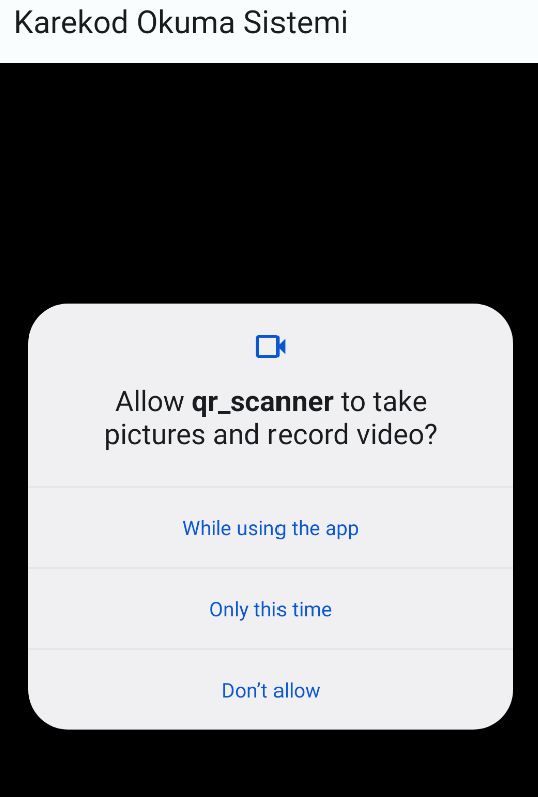

# A QR application where you can send requests to your own APIs. (Flutter/Dart)

## Before start :

#### -Run this command in the terminal to get the dependencies: 'flutter pub get'.

#### -Make sure to change ~YOUR API~.

For more help please contact me on my email: malkoceren24@gmail.com

 
